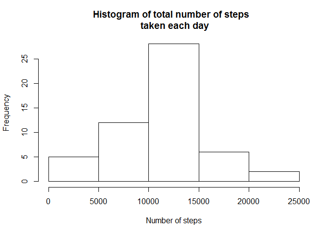
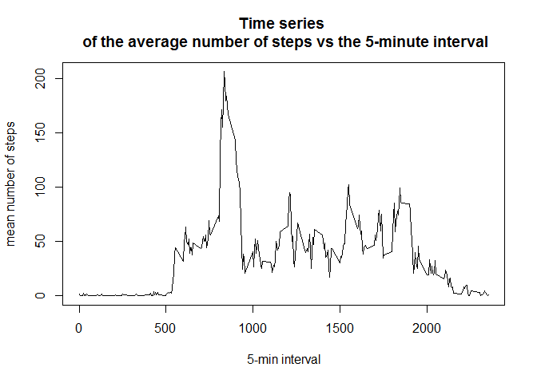
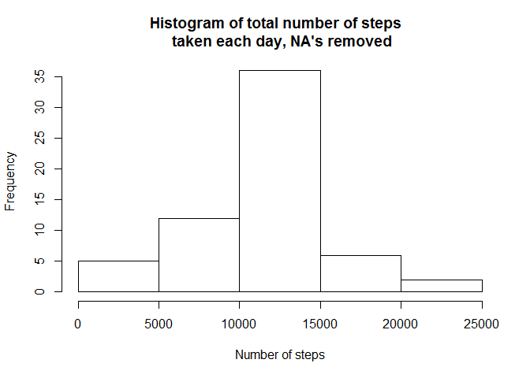

# Reproducible Research: Peer Assessment 1


## Loading and preprocessing the data


```r
if (!file.exists("activity.csv")) {
    tempzipfile <- tempfile()
    zipfileURL <- "https://d396qusza40orc.cloudfront.net/repdata%2Fdata%2Factivity.zip"
    download.file(zipfileURL, tempzipfile)
    data <- read.csv(unz(tempzipfile, "activity.csv"))
    unlink(tempzipfile)
} else {
    data <- read.csv("activity.csv")
}
```


## What is mean total number of steps taken per day?

```r
daily_data <- data.frame(steps = tapply(data$steps, data$date, sum), 
                         date = as.Date(unique(data$date)))
row.names(daily_data) <- c(1:length(daily_data$date))

hist(daily_data$steps, main = "Histogram of total number of steps  \n taken each day", 
     xlab = "Number of steps")
```

 

```r
mean_steps_per_day <- mean(daily_data$steps, na.rm = TRUE)
median_steps_per_day <- median(daily_data$steps, na.rm = TRUE)
cat ("mean number of steps =", mean_steps_per_day, 
     "\nmedian number of steps =", median_steps_per_day)
```

```
## mean number of steps = 10766.19 
## median number of steps = 10765
```

## What is the average daily activity pattern?

```r
five_min_avg_data <- data.frame(steps = tapply(data$steps, data$interval, mean, na.rm=TRUE),
                                interval = data$interval[1:(24*12)]) # 24 hours 12 5-mins per hour
row.names(five_min_avg_data) <- c(1:length(five_min_avg_data$interval))
plot(five_min_avg_data$interval, five_min_avg_data$steps, type="l", 
     main = "Time series \n of the average number of steps vs the 5-minute interval", 
     xlab = "5-min interval", ylab = "mean number of steps")
```

 

```r
max_steps_interval <- five_min_avg_data$interval[which.max(five_min_avg_data$steps)]
cat("max steps averaged 5-min interval:", max_steps_interval)
```

```
## max steps averaged 5-min interval: 835
```
In average, maximum number of steps occur in the morning, around 8:35am.


## Imputing missing values
If loaded data contains "NA" steps in a given 5-min position, the "NA" value is replaced by an averaged steps vaue for that particular 5-minutes interval, calculated over all the days where corresponding data is available.

```r
cat("Number of NA's in the data: ", sum(is.na(data$steps)))
```

```
## Number of NA's in the data:  2304
```

```r
for (irow in 1:length(data$steps)){
    if (is.na(data$steps[irow])) { 
        index_in_5min <- match(data$interval[irow], five_min_avg_data$interval)
        data$steps[irow] <- five_min_avg_data$steps[index_in_5min]
    }
}
daily_data_na_removed <- data.frame(steps = tapply(data$steps, data$date, sum), 
                         date = as.Date(daily_data$date))
row.names(daily_data_na_removed) <- c(1:length(daily_data$date))

hist(daily_data_na_removed$steps, 
     main = "Histogram of total number of steps  \n taken each day, NA's removed",
     xlab = "Number of steps")
```

 

```r
mean_steps_per_day_na_removed <- mean(daily_data_na_removed$steps, na.rm = TRUE)
median_steps_per_day_na_removed <- median(daily_data_na_removed$steps, na.rm = TRUE)
cat ("mean, na removed =", mean_steps_per_day_na_removed, 
     "\nmedian, na removed =", median_steps_per_day_na_removed)
```

```
## mean, na removed = 10766.19 
## median, na removed = 10766.19
```

Histogram, as well as mean and median step values are almost the same, as for the case when NA's were not removed, difference is insignificant.


## Are there differences in activity patterns between weekdays and weekends?

```r
data$weekdays <- weekdays(as.Date(data$date))
for (irow in 1:length(data$steps)){
    if (data$weekdays[irow] == "Saturday" | data$weekdays[irow] == "Sunday"){
        data$weekdays[irow] <- "weekend"
    } else {
        data$weekdays[irow] <- "weekday"
    }
}
data$weekdays <- factor(data$weekdays, levels = c("weekday", "weekend"))

library(lattice)

f5d <- data.frame(
    steps = tapply(data$steps, list(data$interval, data$weekdays), mean, na.rm=TRUE),
    interval = data$interval[1:(24*12)])
f5d_2plot <- data.frame(c(f5d$interval, f5d$interval), 
                c(f5d$steps.weekday, f5d$steps.weekend), 
                c(replicate(288, "weekday"), replicate(288, "weekend")))
colnames(f5d_2plot) <- c("Interval", "Steps", "weekdays")

figure4 <- xyplot(Steps ~ Interval | weekdays, data = f5d_2plot, 
                  layout = c(1,2), type="l", ylab = "Number of steps")
print(figure4)
```

 

Yes, there is a difference between weekends and weekdays. During weekdays activity usully starts earlier and it is not such intensive in the middle of the day, as it is for weekends. Also on weekends activity finishes later.

